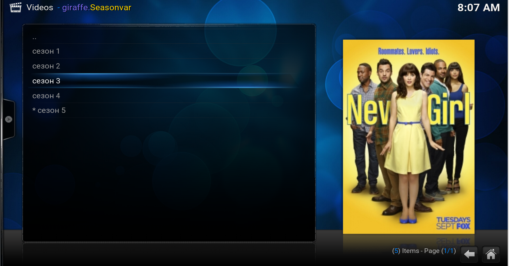

# Плагин для просмотра [seasonvar.ru](http://seasonvar.ru)

Плагин реализует довольно простой функционал:

- отображение обновлений за последнюю неделю
- отображение обновлений за день
- отображение серий сезона
- отображкние колличества сезонов для сериала
- поиск по сериалам
- просмотр серий

# Установка

- Просто добавьте в репозитории [repository.giraffe.zip](https://github.com/weirdgiraffe/kodi.addon.repo/raw/master/repository.giraffe.zip)

# Скриншоты

<!---
vim: ts=4:sw=4:tw=120:et 
-->
